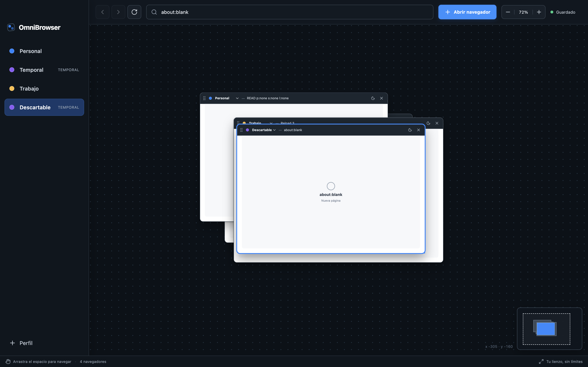

# OmniBrowser

OmniBrowser es un workspace de navegación local para macOS: varias vistas Chromium viven dentro de un canvas infinito y cada tarjeta puede moverse, redimensionarse, superponerse, suspenderse o asociarse a un perfil distinto.

La diferencia esencial frente a una cuadrícula de iframes es el modelo de sesión. Dos tarjetas del mismo perfil usan la misma `Session`/partición de Chromium; por ello comparten cookies, `localStorage`, IndexedDB, Cache Storage, caché HTTP y service workers respetando las reglas web normales de origen. Los perfiles distintos permanecen aislados.



> Estado: MVP funcional para macOS 13 o posterior. La implementación y los POC se validaron localmente en Apple Silicon con Electron 44.4.1. La matriz de CI ejecuta también el gate x64 en un runner Intel; el artefacto Intel no se ejecutó localmente porque el equipo de desarrollo no tiene Rosetta instalado.

## Qué incluye el MVP

- múltiples navegadores Chromium dentro de un único `BrowserWindow`;
- perfiles persistentes y perfiles Private locales, sin cuenta ni sincronización;
- sesión compartida entre tarjetas del mismo perfil y aislamiento entre perfiles;
- URL, atrás, adelante, detener y recargar en el header de la tarjeta activa; los headers inactivos muestran sólo el dominio;
- canvas con pan siempre disponible, zoom de 25–200 %, z-order, arrastre, resize, selección múltiple y snap suave opcional;
- zonas colapsables, stacks, minimizar, bloquear posición, duplicar, fijar en sidebar/viewport, localizar y full screen reversible;
- sidebar en árbol con perfiles, zonas, stacks, fijados, búsqueda, contadores, estados de runtime, cierre y drag-and-drop;
- modo semántico por debajo de 50 % de zoom;
- guardado atómico de workspace, historial URL/título y geometría;
- restauración perezosa de vistas después de reiniciar;
- suspensión manual que destruye el `WebContents` y lo reconstruye con la sesión correcta;
- popups adoptados como tarjetas del mismo perfil, conservando `window.opener`, `postMessage` y `window.close`;
- permisos denegados por defecto y descargas explícitas mediante el diálogo nativo de guardado;
- un agente [Browser Use](https://github.com/browser-use/browser-use) por tarjeta, con chat propio, cola privada, Pausar/Reanudar/Detener y un proveedor OpenAI-compatible configurable: cada agente controla solo su tarjeta mediante una capacidad CDP limitada ([ADR 0005](docs/adr/0005-card-scoped-browser-use-agents.md));
- DMG y ZIP mediante Electron Forge.

No hay backend, cuenta OmniBrowser, telemetría, sincronización cloud ni auto-update. Los agentes solo contactan con el proveedor de IA que configures.

## Requisitos de desarrollo

- macOS 13+;
- Node.js 24.21.0 (`.nvmrc`);
- npm 11.19.0;
- Xcode Command Line Tools;
- Python 3.12 para construir el sidecar de agentes (`npm run agent:build`), necesario para `npm run package` y `npm run make`.

```bash
nvm use
npm ci
npm start
```

El repositorio fija todas las versiones directas y compromete `package-lock.json`. No se admite Node 26 para el flujo de Forge de este proyecto; use la versión indicada en `.nvmrc`.

## Comandos

```bash
npm run verify             # TypeScript, ESLint y tests unitarios y de componentes (Vitest)
npm run test:poc           # almacenamiento, canvas, compuerta de gestos, popups y recursos
npm run test:e2e           # package de prueba + Playwright Electron
npm run agent:test         # protocolo del sidecar de agentes (Python, sin dependencias)
npm run agent:build        # congela el sidecar Browser Use con PyInstaller para la arquitectura nativa
npm run agent:compat       # traza de compatibilidad CDP con Browser Use (requiere OMNIBROWSER_AGENT_PYTHON)
npm run package            # genera OmniBrowser.app (requiere agent:build)
npm run make               # genera DMG y ZIP con firma ad hoc local
npm run test:all           # suite completa
npm run test:perf          # observaciones de memoria, CPU, frames, IPC y guardado (no es un gate)
npm run bench              # tiempos de las derivaciones puras con 500 browsers (no es un gate)
```

La E2E completa del agente usa el sidecar de `npm run agent:build` y un modelo OpenAI-compatible falso en loopback; sin sidecar se omite. Detalles en [agent-runtime/README.md](agent-runtime/README.md).

`npm start` también necesita `npm run agent:build` para que los agentes funcionen; sin él, el chat del agente lo indica. El paquete de prueba (`npm run package:test`, que ejecuta `npm run test:e2e`) se escribe en `out/test-stub/` y no puede ejecutar agentes; la aplicación que se usa es la de `out/OmniBrowser-darwin-<arch>/`, generada por `npm run package`.

`npm run test:e2e:only` usa el bundle de `.webpack/<arch>` generado por `npm run package`; `npm start` lo reemplaza por el bundle de desarrollo, así que conviene volver a empaquetar antes de repetir solo las E2E. Las E2E escriben sus capturas en `test-results/visual/` y el POC de canvas en `test-results/poc/`; para reemplazar las evidencias versionadas de `docs/design/` o `docs/poc-results/` después de revisarlas, use `OMNIBROWSER_UPDATE_VISUAL_EVIDENCE=1` con `npm run test:e2e` o `npm run test:poc:canvas`. La captura del POC solo incluye las vistas nativas si la terminal tiene permiso de grabación de pantalla; sin él, el POC avisa y no reemplaza la evidencia.

Si el repositorio está dentro de iCloud Drive u otro File Provider que reinyecta atributos Finder en bundles `.app`, use un directorio de salida temporal para que macOS pueda verificar la firma ad hoc:

```bash
OMNIBROWSER_OUT_DIR="$(mktemp -d /tmp/omnibrowser-out.XXXXXX)" npm run make
```

Los E2E usan el bundle Webpack de producción con Electron sin fuses porque Playwright necesita el inspector CLI para automatizar la aplicación. El artefacto empaquetado sí lleva los fuses de seguridad y se comprueba por separado.

## Modelo de perfiles

| Perfil | Partición Electron | Disco | Tras reiniciar |
|---|---|---|---|
| Persistente | `persist:omnibrowser-profile-<uuid>` | Gestionado por Chromium | Vuelven perfil, tarjetas y almacenamiento durable |
| Private | `omnibrowser-private-<launch-id>-<uuid>` | En memoria durante el proceso | No vuelve perfil, browser, URL, historial, zona, stack ni pin |

> Private by design. No accounts, no sync servers, no browsing log. Your canvas lives on your machine.

Compartir una partición no elimina las restricciones de origen, dominio, SameSite o top-level site. Por ejemplo, dos vistas del mismo perfil pueden reutilizar la sesión de un sitio, pero `https://a.example` no obtiene acceso arbitrario al almacenamiento DOM de `https://b.example`.

Las cookies sin `expirationDate` son cookies de sesión: se comparten mientras OmniBrowser está abierto, pero no se exportan ni se reconstruyen después de salir. Las cookies persistentes y el resto del almacenamiento durable son responsabilidad de Chromium.

Cambiar un browser de perfil no muta la sesión de origen. OmniBrowser pide confirmación, destruye la vista y crea otra con la `Session` de destino. Entre perfiles del mismo tipo conserva el historial sanitizado; al cruzar el límite Private/persistente transfiere únicamente la URL actual, nunca cookies, almacenamiento ni historial de sesión. El perfil de origen queda intacto.

## Arquitectura

```text
React shell (omnibrowser://app)
  └─ preload mínimo y tipado
      └─ IPC validado con Zod
          └─ proceso principal
              ├─ WorkspaceModel / WorkspaceStore
              ├─ ProfileSessionManager
              ├─ BrowserRuntime
              ├─ SaveScheduler
              ├─ AgentManager ─ ScopedCdpGateway ─ sidecar Browser Use (uno por tarea)
              └─ WebContentsView por tarjeta
                   └─ Session Chromium por perfil
```

El contenido remoto nunca recibe el preload del shell, Node.js, `ipcRenderer` ni objetos Electron. React dibuja el chrome y calcula los rectángulos; el proceso principal posiciona los `WebContentsView` nativos. La interfaz del shell está protegida por `ErrorBoundary` y los diálogos modales usan `PromptModal` con la clase `.native-occluder` para evitar ser perforados por vistas Chromium. Las comparaciones geométricas usan `sameRect` centralizado. Consulte:
- [Arquitectura detallada](docs/architecture.md)
- [ADR 0001: Motor y modelo de perfiles](docs/adr/0001-engine-and-profile-model.md)
- [ADR 0002: Persistencia atómica y recuperación ante corrupción](docs/adr/0002-atomic-persistence-and-corruption-recovery.md)
- [ADR 0003: Composición nativa WebContentsView y oclusión](docs/adr/0003-single-window-canvas-layout-and-native-occlusion.md)
- [ADR 0004: Compuerta de gestos y eventos de rueda](docs/adr/0004-gesture-gating-and-wheel-event-handling.md)
- [ADR 0005: Agentes Browser Use aislados por tarjeta](docs/adr/0005-card-scoped-browser-use-agents.md)
- [Modelo de seguridad](docs/security-model.md)

## Datos locales y privacidad

En una app empaquetada, el workspace y los datos de Chromium viven bajo el directorio `userData` de Electron, normalmente `~/Library/Application Support/OmniBrowser` en macOS. Las ejecuciones de desarrollo (`npm start`) usan `~/Library/Application Support/OmniBrowser Development` para no compartir cookies ni workspace con la app instalada. Solo puede haber una instancia por directorio: abrir otra enfoca la ventana existente.

- `workspace.json` usa el esquema V2 y contiene sólo perfiles persistentes: URLs/títulos del historial, cámara, browsers, geometría, zonas, stacks, orden del sidebar, pins, presentación, bloqueo y preferencias.
- `workspace.backup.json` conserva el último snapshot válido.
- `workspace.v1-backup.json` conserva una copia única del archivo V1 original antes de la primera escritura V2.
- Un archivo ilegible, o creado por una versión más reciente, nunca se sobrescribe: se conserva como `workspace.corrupt-*.json` o `workspace.future-v<N>-*.json` y la app avisa con su nombre.
- Chromium conserva cookies y almacenamiento web dentro de sus particiones persistentes.
- `agents/<browserId>.json` guarda la conversación y la actividad del agente de una tarjeta persistente (sin claves, capacidades CDP, DOM ni capturas); los agentes Private viven solo en memoria. `agent-provider.json` guarda la URL, el modelo y la clave del proveedor cifrada con el llavero del sistema; con «Recordar la clave en este Mac» desmarcado, o si macOS deniega el llavero, la clave vive solo en memoria hasta cerrar la app y el archivo guarda solo la URL y el modelo.
- OmniBrowser no implementa un gestor de contraseñas ni exporta cookies o credenciales.

Las URLs pueden contener información sensible; trate `workspace.json` como datos privados del usuario. Un perfil Private evita el log propio y usa una sesión en memoria, pero no pretende ser un modo antiforense frente a un atacante con acceso al equipo. Una descarga que el usuario acepte puede permanecer en disco aunque se haya originado en un perfil Private; OmniBrowser no guarda una ruta ni un historial propio de descargas. Mientras el diálogo de guardado está abierto, Chromium ya escribe los bytes en un archivo temporal oculto de la carpeta Descargas; se elimina al salir de la app, pero un cierre forzado en ese momento podría dejarlo.

## Seguridad y límites conocidos

- Solo se navega a `https:`, `http:` y `about:blank`.
- Los protocolos externos requieren confirmación y una allowlist.
- Cámara, micrófono, geolocalización, notificaciones, USB, Bluetooth, MIDI, captura de pantalla y permisos equivalentes se deniegan.
- Sólo un `WebContents` registrado puede iniciar una descarga. Electron muestra el diálogo nativo, OmniBrowser no elige la ruta, no la serializa y cancela descargas activas —borrando el archivo parcial— al cerrar o reasignar su browser o al salir de la aplicación.
- Los gestos de trackpad que requieren cancelar eventos dentro de un `WebContentsView` —pan sobre un browser inactivo e historial horizontal— no están disponibles: Electron 44 no permite consumir la rueda antes de que la página se desplace, lo que produciría doble scroll. La rueda sobre un browser desplaza solo su página; el canvas conserva rueda en área vacía, minimapa, flechas y Space+drag. El POC `gesture-interception-gate` vigila esa limitación en cada versión de Electron.
- DevTools remotos solo están disponibles en desarrollo.
- Un sitio puede detectar Electron, bloquear navegadores embebidos o exigir reautenticación. Compartir correctamente la partición no garantiza que un proveedor acepte su flujo OAuth.
- La prueba manual con Google debe hacerse únicamente con una cuenta de prueba autorizada y nunca forma parte de CI.
- La firma Developer ID y notarización requieren secretos del mantenedor; los builds locales reciben una firma ad hoc posterior a los fuses y no se presentan como artefactos notarizados. Una release usa `OMNIBROWSER_MAC_SIGN_IDENTITY` con una identidad Developer ID instalada y sigue el checklist de publicación.
- Cada build local con firma ad hoc es una aplicación nueva para el llavero de macOS: la primera vez que guarda o usa la clave del proveedor (o cookies cifradas), macOS pide la contraseña de inicio de sesión del Mac para la entrada «OmniBrowser Safe Storage». La contraseña la recibe macOS, no OmniBrowser; «Permitir siempre» la recuerda para ese build. Si se deniega, el agente usa la clave solo durante la sesión y el diálogo explica cómo guardarla después; desmarcar «Recordar la clave en este Mac» evita el llavero por completo.

## Evidencia del MVP

- [Resultados de los cinco POC](docs/poc-results/README.md)
- [Inventario de QA y compuertas manuales](docs/qa-inventory.md)
- [Ledger de fidelidad visual](docs/design/fidelity-ledger.md)
- [Auditoría de dependencias y hardening](docs/security-audit.md)
- [Auditoría técnica 2026-09: hallazgos, correcciones y mediciones](docs/engineering-audit.md)
- [Hardening posterior al canvas espacial: dependencias, gestos, descargas y rendimiento](docs/hardening-2026-09.md)
- [Auditoría de los agentes por tarjeta: hallazgos, correcciones y verificación](docs/agent-audit-2026-09.md)
- [Checklist de release](docs/release-checklist.md)

Los números de memoria publicados son observaciones de una máquina concreta, no promesas de consumo ni benchmarks generalizables.

## Contribuir

Lea [CONTRIBUTING.md](CONTRIBUTING.md), [SECURITY.md](SECURITY.md) y el [Código de conducta](CODE_OF_CONDUCT.md). Los cambios que toquen sesiones, navegación, IPC, permisos o persistencia necesitan tests de regresión y una explicación explícita del límite de confianza afectado.

## Licencia

[MIT](LICENSE) © 2026 OmniBrowser contributors.
